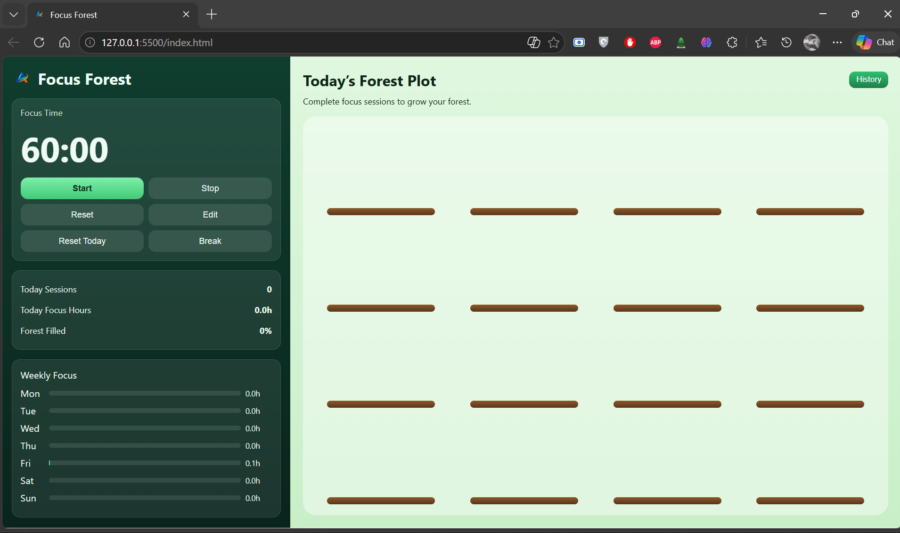

# Focus Forest — Visual Study Timer

## Overview
Focus Forest is a browser-based study timer that visualizes focus sessions as a growing forest.  
Instead of tracking time alone, the application provides visual feedback based on user consistency and session completion.

## How It Works

### Timer System
- User sets a focus duration (default: 60 minutes)
- Controls:
  - Start
  - Stop
  - Reset
  - Break
- Timer runs in real-time using JavaScript

---

### Growth Logic
Each focus session is divided into stages:

- **Start → 🌱
- **Mid progress → 🌿
- **Completed session → 🌳

These stages are updated dynamically based on elapsed time.

### Forest Grid
- The right panel contains a grid (fixed slots)
- Each completed session fills one slot
- Over time, the grid represents total focus for the day

### Tracking System
The application maintains:

- Number of sessions completed
- Total focus hours
- Forest completion percentage
- Weekly focus distribution

### History
- Users can view previous sessions
- Helps track consistency over time

## Features
- Visual representation of focus sessions
- Session-based progress system
- Daily and weekly tracking
- Simple UI for ease of use
- Interactive controls (start, break, reset)

## Tech Stack
- HTML
- CSS
- JavaScript

## Screenshot

## How to Run
1. Clone the repository
2. Open `index.html` in any browser

## Project Scope
Frontend-only application  
No backend/database integration

## Note on Logo Usage
The logo used in this project is my personal brand identity and should not be reused without permission.

## Growth Note
This project reflects a shift from building basic tools to thinking about user experience and behavior while designing applications.
